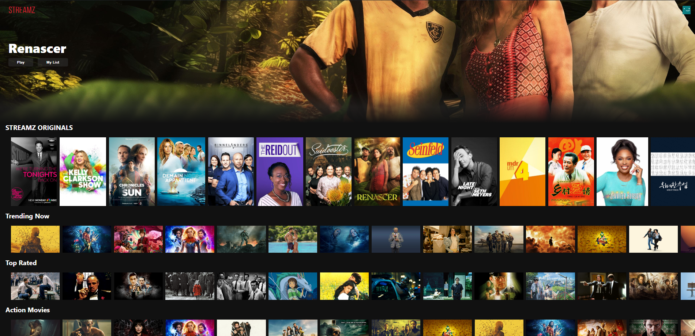
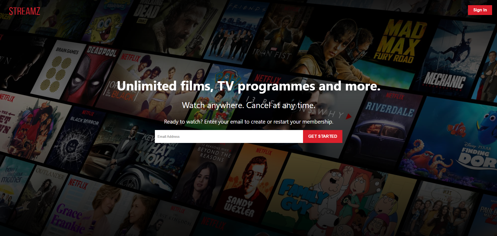
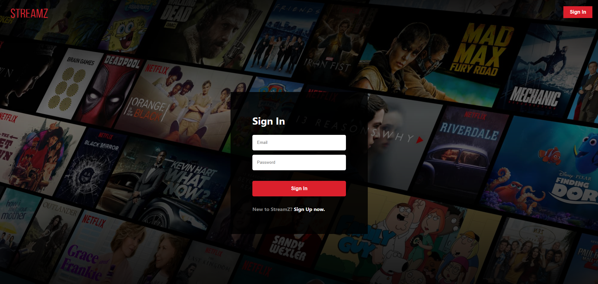

# 🍿 StreamZ

StreamZone, also known as Streamz, is a Netflix clone where you can create accounts and discover movies

## ✨ Getting Started

1. Clone this project
2. Run `npm i` in the terminal to install all dependencies for your project.
3. Add your own API keys in the `.env` file, which should be created based on the `.env.example` template.
4. Add firebase config details in `/src/firebase.js` file
5. Finally, run `npm run dev` in your terminal to start the server.

## ⚙️ Tech Stack

1. ReactJS
2. TMDB API
3. Redux
4. Firebase
5. Google Auth

## 📸 Screenshots

### 🏠 Home Page

### 🔑 Landing Page & Login

